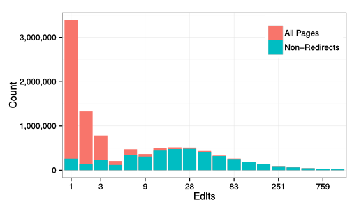

Consider the Redirect
=======================

__ https://en.wikipedia.org/wiki/Main_Page

.. figure:: seattle_redirect.png
   :align: right
   :figwidth: 614px
   
   Example of a redirect displayed in the `Seattle, Washington page on
   English Wikipedia`__ which is a redirect to `Seattle`__. Note the
   small redirect notice below the title.

__ https://en.wikipedia.org/wiki/Seattle,_Washington
__ https://en.wikipedia.org/wiki/Seattle

In wikis, **redirects** are special pages in that silently take readers
from the page they are visiting to another page in in the wiki. In the
`English Wikipedia`__, redirects make up more than half of all article
pages.

Different data sources of handle redirects differently. For example,
`the MediaWiki API`__ will automatically "follow" redirects but the `XML
database dumps`__ treat redirects like normal articles. In both cases,
redirects are often invisible to reseachers.

__ https://www.mediawiki.org/wiki/API:Main_page
__ https://meta.wikimedia.org/wiki/Data_dumps

Because redirects constitute a majority of all pages and see a large
portion of all traffic, Wikipedia reseachers need to take redirects into
account or their findings may be incomplete or incorrect.  For example,
the histogram on this page shows the distribution fo edits across pages
in Wikipedia for every page, and for non-redirects only.  Because
redirects are almost never edited, the distributions are very different.
Similarly, because redirects are viewed but almost never edited, any
study of views over articles should also take redirects into account.

   Histograms of pages in the article namespace based on the number of
   edits on a log scale.  The red histogram includes all pages in the
   article namespace (N = 9,729,989). The blue graphs includes only
   pages that were not redirects at the point of data collection (N =
   5,327,561).

Because redirects can change over time, the snapshots of redirects
stored by Wikimedia and published by Wikimedia Foundation are 
incomplete. Taking redirects into account fully involves looking at the
content of every single revision of every article to determine both
when and where pages redirect. 

Much more detail can be found in `Consider the Redirect: A Missing
Dimension of Wikipedia Research`__ — a short paper that we have written
to acccompany this dataset and these tools.  If you use this software or
these data, we would appreciate if you cite the paper:

  *Hill, Benjamin Mako and Aaron Shaw. "Consider the Redirect:  A Missing
  Dimension of Wikipedia Research." In Proceedings of the 10th
  International Symposium on Open Collaboration (OpenSym 2014). ACM
  Press, 2014.*

__ http://mako.cc/academic/hill_shaw-consider_the_redirect.pdf

Generating Redirect Spells
=============================

Generating redirect spells from an MediaWiki XML dump involves two steps:

1. Searching the full text of every revision of every page in a dump to
   determine if any given revision is a redirect.

2. Using the results of (1) to generate a list of "spells" that describe
   periods of time that articles in a wiki redirect to other articles.

We have `publicly released software in Python and R to do these two
steps`__ under the `GNU GPL version 3`__. The software is designed for
people already comfortable with working with MediaWiki XML dumps and the
tools and software necessary to do this. We have provided
`documentation`__ on how to use these tools.

__ http://projects.mako.cc/source/?p=redirect-tools
__ http://www.gnu.org/licenses/gpl-3.0.html
__ README.html

You can download the software from our git repository like::

  git clone git://projects.mako.cc/redirect-tools

Detailed documentation on how to use the software is in available in our
README file.

Redirect Spell Data
=========================

In our paper `Consider the Redirect`__, we present an analysis of
redirect data from English Wikipedia in the dump created in October
2012. You can download `the dump files we used`__ from `the Wikimedia
Foundation dataset archive`__.  Because generating these dumps can be
computationally intense, we have published the output of the software
above run on the this dump. This includes 9,277,563 redirect spells that
our software identified and is the dataset used in the paper.

You can download the dataset in the following formats:

- `RData (240MB)`__ — Suitable for use in GNU R
- `bzip2 compressed tab seperated values (178MB)`__ — Suitable for use
  in other languages and statistical packages.

__ http://mako.cc/academic/hill_shaw-consider_the_redirect.pdf
__ http://dumps.wikimedia.org/enwiki/20121001/
__ http://dumps.wikimedia.org/
__ enwiki_201210-redirect_spells-v1.RData
__ enwiki_201210-redirect_spells-v1.tsv.bz2

More Information
==================

For details about the dataset, why it is important, and for examples on
how it can be used to come to better findings in Wikipedia research,
please read `the companion paper`__.

__ http://mako.cc/academic/hill_shaw-consider_the_redirect.pdf

If you notice issues or bugs in our data or `code`__, contact `Benjamin
Mako Hill`__ or `Aaron Shaw`__.  

__ http://projects.mako.cc/source/?p=redirect-tools
__ http://mako.cc/contact/
__ http://aaronshaw.org/

Patches and improvements are welcome! Details on `how to produce and send
a patch using git are online`__.

__ http://projects.mako.cc/source/

